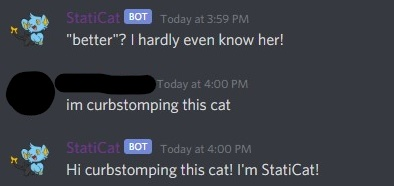
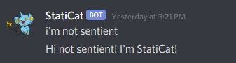

# StatiCat

#### A Discord bot built in Python 3.7

To install/update requirements into an Anaconda environment:
```shell
pip install -r requirements.txt
```

### TODO: Make better documentation :)

## Thanks to the following APIs:
* [15.ai](https://15.ai)

## I have referenced code from the following repositories to make certain cogs. Thank you to:

* https://github.com/Cog-Creators/Red-DiscordBot
    * Used for the Cog reloading functionality in Cog "Cogs"
* https://github.com/asdvek/DeepFryBot
    * Used for Cog "Fry"
* https://github.com/AliaksandrSiarohin/first-order-model
    * Used for Cog "DeepFake"
    * Make sure you download vox-cpk.pth.tar and vox-adv-cpk.pth.tar and put them in `deepfake/`!
        * https://mega.nz/file/4cAyTIpT#5c5n43cLo4xc_uSgyBMIxMLB1S3_tNtzeiEZALnIyyc
        * https://mega.nz/file/MNJw3ASA#ykp34kcenxKAEoTAW6__UhSrkxdchzqBq2p6qSzCkLE

#### A pinnacle of comedy




